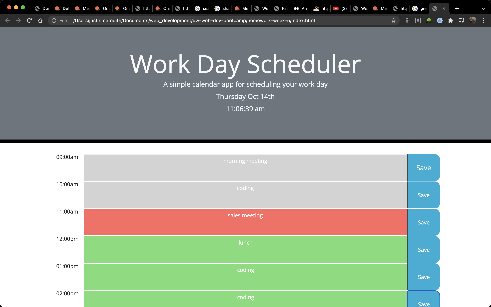
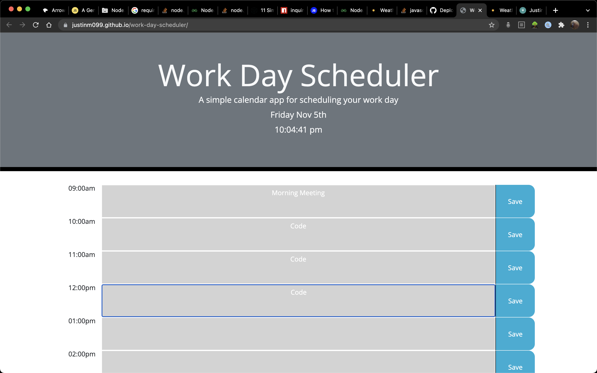

## Work Day Scheduler
This is a simple app that allows the user to schedule their work day. The current day and time are displayed on the page, 
and the common work hours are displayed in blocks. 

## Functionality
The user may enter their plans for any given hour as input directly into the block indicated for that hour. There is a save
button for each block, and their data will persist when the browser is reloaded or closed.

## Styling
The input blocks are styled to dynamically change colors with the passing of time. Time blocks in the past appear in grey,
the current time block appears in red, and future time blocks appear in green.

## Technologies Used
-Javascript
-jQuery
-Bootstrap

## Screenshot
Here are two screenshots of the app:

## Deployed Page
See a deployed version here: https://justinm099.github.io/work-day-scheduler/

## Contact
Please let me know if you have any questions! justinm099@mac.com
